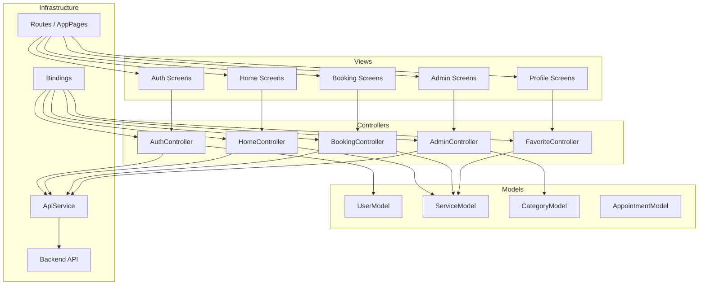
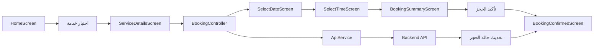
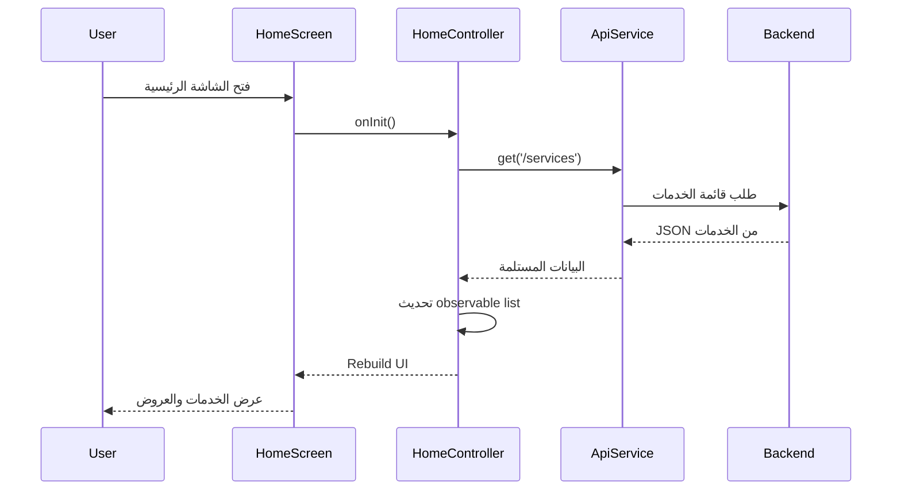

# وثيقة معماريّة GetX في تطبيق Belle

## مقدمة

يتبع هذا التطبيق نموذج GetX المعتاد في Flutter، حيث يتم تقسيم التطبيق إلى:

- Controllers: إدارة المنطق والـ state
- Views: عناصر الواجهة
- Models: تمثيل البيانات
- Bindings: تسجيل الكائنات المدارة
- Routes: توجيه الانتقال بين الصفحات
- Services: التعامل مع الخادم

## 1) مخطط العمارة المنطقية

هذا المخطط يوضح كيف تقسم البنية التطبيق إلى طبقات واضحة وتعمل معاً داخل GetX.



## 2) مخطط تدفق الحجز في التطبيق

هذا المخطط يوضح مسار المستخدم عند حجز خدمة من قائمة الخدمات حتى تأكيد الحجز.



## 3) مخطط التسلسل للحصول على قائمة الخدمات

هذا المخطط يوضح كيف يتم جلب قائمة الخدمات من الخادم وتحديث واجهة المستخدم عبر GetX.



## 4) مخطط الصفوف لأهم النماذج والـ Controllers

```mermaid
classDiagram
    class GetxController
    class AuthController extends GetxController {
        +currentUser
        +isLoading
        +createAccount()
        +verifySignupCode()
        +login()
    }

    class BookingController extends GetxController {
        +selectedService
        +selectedDate
        +selectedTime
        +submitBooking()
    }

    class FavoriteController extends GetxController {
        +favoriteList
        +toggleFavorite()
    }

    class AdminController extends GetxController {
        +services
        +bookings
        +addService()
        +updateService()
    }

    class UserModel {
        +id
        +name
        +email
        +phone
        +fromJson()
    }

    class ServiceModel {
        +id
        +serviceName
        +categoryName
        +price
        +rating
        +fromJson()
    }

    class AppRoutes {
        +loginScreen
        +mainScreen
        +serviceDetails
        +bookingSummary
        +adminDashboard
    }

    AuthController --> UserModel
    BookingController --> ServiceModel
    FavoriteController --> ServiceModel
    AdminController --> ServiceModel
    AppRoutes --> "getPages"
```

## 5) ملاحظات عن التنفيذ في المشروع

- تم استخدام `GetMaterialApp` في `main.dart` لتحديد إعدادات التطبيق العالمية.
- تم تعريف المسارات في `app_pages.dart` باستخدام `GetPage`.
- تم تسجيل الاعتماديات الأساسية في `bindings/initial_bindings.dart`.
- تستخدم الشاشات `Get.put()` و `Get.lazyPut()` وفق الحاجة.
- يتم استخدام `Rx` لإعادة بناء الواجهة عند تغيير الحالة.

## الخلاصة

تضمن هذه البنية تطبيقاً قابلًا للتطوير ومرنًا في إدارة الحالة، مع فواصل واضحة بين الشاشات، المنطق، والبيانات. هذا يسهّل إضافة ميزات جديدة مثل الحجز، الإدارة، المفضلة، أو المراسلات داخل التطبيق دون الحاجة لتغيير هيكل التطبيق بشكل كبير.
