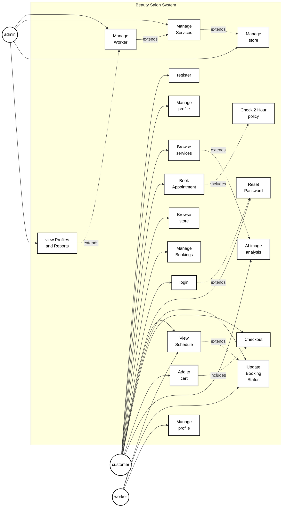

# Use Case Diagram - Belle Beauty Salon

فيما يلي كود Mermaid يطابق الأسلوب العام للمخطط في الصورة، مع تمثيل المستخدمين على الجانبين ووظائف النظام داخل الصندوق الرئيسي.

## ملاحظات
- هذا المخطط يوضح حالات الاستخدام الأساسية للمشروع.
- تم حساب العلاقات بشكل عام لتقريب أسلوب الصورة، مع وجود `extends` و `includes` لتوضيح العلاقة بين الحالات.
- إذا أردت، أستطيع تعديل هذا الكود ليصبح أقرب إلى الصورة بشكل أكثر دقة من ناحية الترتيب والحجم أو تحويله إلى نسخة عربية/إنجليزية كاملة.
