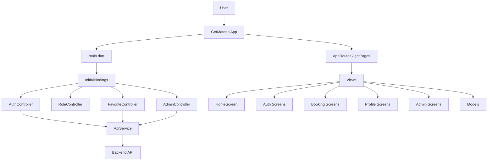
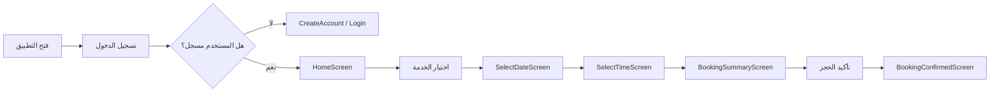
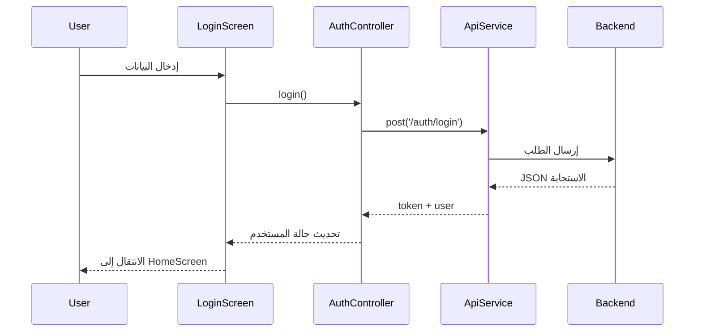

# Belle Beauty Salon — Flutter App

A full-featured beauty salon booking app built with Flutter and GetX state management.  
Designed as a student learning project covering navigation, state management, UI design, and data flow.

## وثائق المعمارية والتدفق

تم إعداد وثائق معماريّة خاصة لهذا المشروع باستخدام Mermaid، تشمل مخططات Flowchart وClass Diagram وSequence Diagram وفق بنية GetX الصحيحة في تطبيق Belle.

- وثيقة معماريّة GetX: [docs/getx-architecture.md](docs/getx-architecture.md)

### مخطط العمارة العامة داخل GetX

هذا المخطط يوضح كيف تتفاعل طبقات التطبيق: Views، Controllers، Models، Bindings، Routes، وAPI.



### مخطط رحلة المستخدم أثناء حجز الموعد

هذا المخطط يوضح مسار المستخدم من فتح التطبيق إلى تأكيد الحجز داخل دورة GetX.



### مخطط تسلسل طلب API

هذا المخطط يوضح تدفق البيانات عند تسجيل الدخول أو طلب خدمة من الخادم.



---

## Tech Stack

| Package | Version | Purpose |
|---|---|---|
| `flutter` | SDK | UI framework |
| `get` | ^4.7.3 | State management, routing, dependency injection |
| `flutter_screenutil` | ^5.9.3 | Responsive sizing (`.w`, `.h`, `.r`, `.sp`) |
| `flutter_svg` | ^2.3.0 | SVG icon rendering |
| `google_fonts` | ^6.2.1 | Outfit font family |

---

## Prerequisites

Make sure the following are installed before running the project:

- [Flutter SDK](https://docs.flutter.dev/get-started/install) — version `^3.10.1`
- Dart SDK (comes with Flutter)
- Android Studio **or** VS Code with Flutter extension
- An Android/iOS emulator or a physical device

Verify your environment:

```bash
flutter doctor
```

---

## Getting Started

### 1. Clone the repository

```bash
git clone <your-repo-url>
cd belle_beauty_salon
```

### 2. Install dependencies

```bash
flutter pub get
```

### 3. Run the app

```bash
# Run on the default connected device
flutter run

# Run on a specific device (get device list first)
flutter devices
flutter run -d <device-id>

# Run in debug mode (default)
flutter run --debug

# Run in release mode (faster, no debug overlay)
flutter run --release

# Run in profile mode (performance analysis)
flutter run --profile
```

---

## Build Commands

### Android

```bash
# Build a debug APK
flutter build apk --debug

# Build a release APK (signed)
flutter build apk --release

# Build an App Bundle (recommended for Play Store)
flutter build appbundle --release
```

The output APK is located at:
```
build/app/outputs/flutter-apk/app-release.apk
```

### iOS (macOS only)

```bash
# Build for iOS
flutter build ios --release

# Build an IPA for distribution
flutter build ipa
```

### Web

```bash
flutter build web
```

### Windows

```bash
flutter build windows
```

---

## Development Commands

### Hot reload & restart

```
r       → Hot reload (preserves state)
R       → Hot restart (clears state)
q       → Quit
d       → Detach (leave app running)
```

These are typed in the terminal while `flutter run` is active.

### Code generation (if added in future)

```bash
# Run build_runner for generated files (e.g. json_serializable)
dart run build_runner build

# Watch mode — rebuilds on file change
dart run build_runner watch

# Clean generated files
dart run build_runner clean
```

### Dependency management

```bash
# Add a new package
flutter pub add <package_name>

# Remove a package
flutter pub remove <package_name>

# Upgrade all packages to latest compatible version
flutter pub upgrade

# Show outdated packages
flutter pub outdated

# Check pubspec.lock without modifying
flutter pub get --no-example
```

### Linting & analysis

```bash
# Analyse the project for errors and warnings
flutter analyze

# Format all Dart files
dart format .

# Format a specific file
dart format lib/main.dart

# Check formatting without writing changes
dart format --output=none --set-exit-if-changed .
```

### Testing

```bash
# Run all tests
flutter test

# Run a specific test file
flutter test test/widget_test.dart

# Run tests with coverage report
flutter test --coverage

# View coverage report (requires lcov)
genhtml coverage/lcov.info -o coverage/html
open coverage/html/index.html
```

### Cleaning the project

```bash
# Remove build output and generated files
flutter clean

# After cleaning, always re-fetch packages
flutter pub get
```

### Useful diagnostic commands

```bash
# List all connected devices
flutter devices

# List available emulators
flutter emulators

# Launch a specific emulator
flutter emulators --launch <emulator-id>

# Show Flutter & Dart version
flutter --version

# Show detailed environment info
flutter doctor -v

# Show dependency tree
flutter pub deps
```

---

## Project Structure

```
belle_beauty_salon/
├── assets/
│   ├── data/               # JSON data files (services.json)
│   ├── icons/              # SVG & PNG icons
│   └── images/             # Category and service images
│
├── lib/
│   ├── bindings/
│   │   └── initial_bindings.dart    # Global GetX dependency registration
│   │
│   ├── constant/
│   │   ├── app_colors.dart          # Brand colour palette
│   │   ├── app_images.dart          # Asset path constants
│   │   └── app_routes.dart          # Named route constants
│   │
│   ├── models/
│   │   ├── service_model.dart       # Core service data model
│   │   └── specialist_model.dart    # Specialist data model
│   │
│   ├── translations/                # Localisation strings
│   │
│   ├── views/
│   │   ├── auth/                    # Login & Create Account screens
│   │   ├── booking/                 # Booking flow (4 steps) + Appointments tab
│   │   ├── favorite/                # Saved / Wishlist screen
│   │   ├── home/                    # Home, Category, Service Details screens
│   │   ├── offers/                  # Special Offers & Trending screen
│   │   ├── profile/                 # Profile & Settings screens
│   │   └── rolle/                   # Role selection screen
│   │
│   ├── app_pages.dart               # GetX route → screen mapping
│   └── main.dart                    # App entry point
│
├── CHANGES.md              # Detailed feature & change log
├── pubspec.yaml            # Package dependencies & asset declarations
└── README.md               # This file
```

---

## App Flow

```
Launch
  └── Role Selection Screen
        └── Auth Screen (Login / Create Account)
              └── Main Screen (Bottom Navigation)
                    ├── Home
                    │     ├── Category Services Screen
                    │     │     └── Service Details Screen
                    │     │           └── Booking Flow
                    │     │                 ├── Select Date
                    │     │                 ├── Select Time
                    │     │                 ├── Booking Summary
                    │     │                 └── Booking Confirmed
                    │     └── Special Offers Screen
                    ├── Appointments (Upcoming / Past / Cancelled)
                    ├── Saved / Favourites Screen
                    └── Profile & Settings
```

---

## State Management (GetX)

| Controller | Registered in | Scope |
|---|---|---|
| `AuthController` | `InitialBindings` | Global |
| `FavoriteController` | `InitialBindings` (fenix: true) | Global, survives nav |
| `BookingController` | `MainScreen` | Persists across bottom-nav tabs |
| `HomeController` | `HomeScreen` | Screen-local |
| `CategoryDetailsController` | `CategoryServicesScreen` (tagged) | Screen-local |
| `ServiceDetailsController` | `ServiceDetailsScreen` | Screen-local |
| `RoleController` | `RolleScreen` | Screen-local |

---

## Responsive Sizing

All dimensions use `flutter_screenutil`. Initialize it in `main.dart`:

```dart
ScreenUtilInit(
  designSize: const Size(390, 844),  // base design canvas
  builder: (_, child) => child!,
)
```

| Suffix | Meaning |
|---|---|
| `.w` | Scale relative to design width |
| `.h` | Scale relative to design height |
| `.r` | Scale relative to the smaller axis (good for radii & icon sizes) |
| `.sp` | Scale font size with screen + user font preferences |

---

## Common Issues

| Problem | Fix |
|---|---|
| `flutter pub get` fails | Check your Dart SDK version matches `^3.10.1` in `pubspec.yaml` |
| `LateInitializationError: service` | Always pass `arguments: serviceModel` when navigating to service details |
| `RenderFlex overflowed` in AppBar | Move step indicators into AppBar's `bottom:` `PreferredSize` slot |
| `Get.find()` throws "not found" | Ensure the controller is registered in `InitialBindings` or in a parent widget before the screen builds |
| Icons not showing (SVG) | Make sure `flutter_svg` is in `pubspec.yaml` and assets are declared |
| Fonts not loading | Verify asset paths under `fonts:` in `pubspec.yaml` match actual file paths |

---

## Contributing (for students)

1. Create a new branch for each feature: `git checkout -b feature/my-feature`
2. Keep one feature per branch
3. Run `flutter analyze` before committing — fix all warnings
4. Run `dart format .` to auto-format code
5. Write a short commit message describing **why**, not just what: `git commit -m "fix: pass ServiceModel to details screen to avoid LateInitializationError"`
6. Open a Pull Request and describe the change

---

## License

This project is for educational purposes only.
